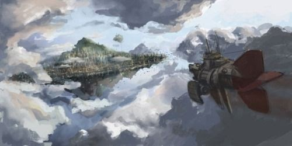
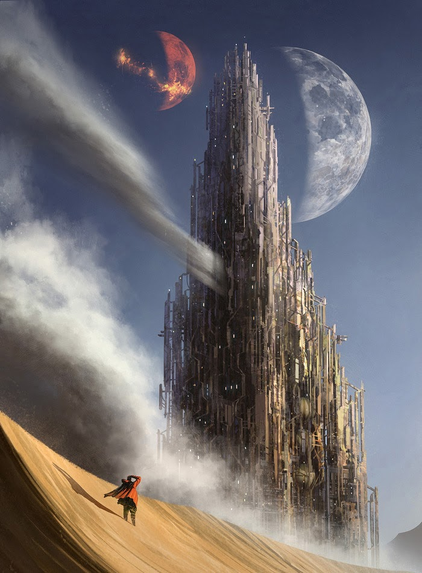

# The Cities of Mardha

Maecenas sed congue lectus. Suspendisse nec elit id lacus scelerisque gravida. Aenean tincidunt, diam molestie bibendum finibus, tellus leo facilisis magna, eget imperdiet risus mauris sed nunc. In rutrum malesuada volutpat. Nullam iaculis accumsan nunc sit amet consequat. Nullam vel diam eu velit sollicitudin ornare eu eget velit. Phasellus commodo, nisl sit amet condimentum mattis, felis diam euismod lacus, in commodo nisi dui sed leo. 

## Arteris <i style="float:right">A New Hope</i>

Arteris

The Mecca of Mardha, a metropolis that floats above the ruins of Zaresyn and serves as home to the central Syn harvesting operation. Brings the various cultures of Mardha together for commerce and political engagements. Creates and distributes Mardha’s universal currency, Shards.
 
 

## City of Rust <i style="float:right">Refuge of Machines</i>

City of Rust

Sentient mechanical constructs from all over Mardha who find themselves lost journey through the harsh deserts of “sahara” to the legendary City of Rust. A place where all those mechanical can live in peace without the scrutiny and complications of flesh-folk.
 
 
 
 
 
 
 
 
 
 
 