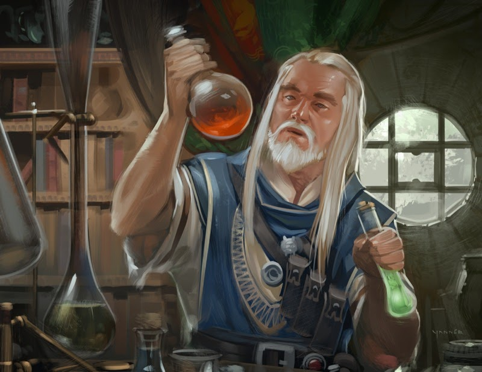

# Magics of Mardha

Mardha is filled with magic. But with so many cultures populating the world, it only follows that there are almost as many manifestations of this magic. On the following pages you'll find the prodominant methods of peforming magical feats, and the powerful sources of the effects.

## Prime Forces

Magic can only be performed with a powerful source. Some casters find this power around them, others find it within themselves, and others even within the world itself. All of this magic relies on one (or more) of the four Prime Forces.

### Arcum
---

Arcum Crystals are a naturally forming resource which can be found sparsely all over Mardha. It isn't yet understood what conditions cause the crystals to form, but it is known that they hold large amounts of energy and only tiny amounts are required to perform great feats.

The crystals are often stored in a powdered form, known as Dust. There are multiple ways to harness this power, but the most common is Scribing.

### Divinity
---

There is little proof of the existance of "true gods", but there are unquestionably many powerful entities which exist outside of the mortal realm. Some of these beings, to varying degrees, attempt to influence the world of Mardha by bestowing power to devout followers or chosen individuals. 

Acts of divinity are unique in that they bring power into Mardha from elsewhere.

Sold your soul to a devil for power? Divinity. Won your powers from a spirit in a gamble? Divinity. Being rewarded for your patronage to a deity? Divinity.

### Syn
---

Beneath Arteris, in the ruins of Zaresyn, the ground is rich with a viscous green fluid known as Syn. The oil-like liquid has enabled a great technological advancement, allowing the creation of mechanical magical tools without the use of Arcum.

Syn is highly toxic. Long-term indirect exposure often results in varying degrees of madness, and direct exposure leads to strange illness, horrific mutations, and death. When stored in large quantities Syn will animate into violent creatues called Synspawn. It is not currently known how this happens.

The revolutionary substance is mostly thought to be a by-product of The Cataclysm, though there are many theories about the nature of the power stored within it. Some see the use of Syn as blasphemy, while others see opportunity in the potential of Syngineering.

### Wakana
---

There is an energy which exists in and around all things in Mardha. It is known by many words, but the commonly used term is Wakana. Through various methods of attunement, focus, and assimilation, individuals have learned to influence this force directly.

Believers in the inherent balance of Wakana tell that all instances of change to this force are mirrored by equal reactions. This leads some to provide sacrifices, or offerings in exchange. Others simply exercise restraint in their effect on Wakana, using it only when necessary.

Ritualistic magics work through manipulation of this force, as do the great feats of self-enhancement managed by the disciples of the Yuu-Shin monestary.

## Arcane Backgrounds

### Alchemy
---

##### ___Prime Force: Arcum / Wakana___

##### ___Casting Skill: Alchemy (Smarts)___

##### ___4 Starting Powers___

Alchemists utilise either the power of Arcum, or their control of Wakana to intensify the properties of mixed reagents, creating magical potions which can be consumed by anyone.

With an hour of downtime an alchemist can make an Alchemy (Smarts) roll, creating four power points worth of potions from their list of known powers on a success, and an additional two per raise.

The power point cost of all created potions cannot exceed the alchemist's total power points.

### Blessings
---

##### ___Prime Force: Divination___

##### ___Casting Skill: Faith (Spirit)___

##### ___3 Starting Powers___

Those who are blessed draw their power from an otherwordly presence of some sort, including deities, devils, or spirits. Their powers are often invoked with a few words of prayer, or by performing established rituals.

Those who possess this power are champions of their particular religions, or chosen playthings of mischievous spirits. They typically have Hindrances that pertain to their service, such as Vow or Obligation. They might also have Connections to others of their religion/order etc. who can help them out when their energies wane.

### Chi - rename incoming
---

##### ___Prime Force: Wakana___

##### ___Casting Skill: Focus (Spirit)___

##### ___2 Starting Powers___

Through meditation and inner peace it is possible to tap into Wakana. With this mastery skilled martial artists can enhance their natural abilities, and consulars can bend the minds of others.

When casting with this background you follow the No Power Points setting rule.
 
 
 
 

### Gifted
---

##### ___Prime Force: Variable___

##### ___Casting Skill: Focus (Unbound)___

##### ___1 Starting Power___

There are many unique instances where an individual obtains, or is born with innate power. The Prime Force in use varies depending on the particular source of innate power.

Gifted only get 1 power when they take the new powers edge, but there is no linked trait for their casting skill, they can use powers when restrained & bound, and they add +1 to Focus rolls.

### Hexslinging
---

##### ___Prime Force: Divination___

##### ___Casting Skill: Gambling (Smarts)___

##### ___2 Starting Powers___

Hexslinging gets it's name from the term for a power in the Wildelands (Hex), where the style of spellcasting first originated. Sometimes referred to as Hucksters, they perform feats of divination to contact Manitous, mischievous spirits which roam the space between Mardha and a parallel plane. 

Through a battle of wits a Hexslinger attempts to manifest magical powers from the Manitous. If they're feeling lucky they can engage in a gamble to cast powers with no power point cost and with extra bonuses, but there's a price for losing a bet with a spirit.

Gambling with a Manitous is a free action. To gamble the hexslinger must first announce which power they wish to cast, and with what modifiers. Then draw five cards from the deck, with one additional card per two ranks of Gambling (Smarts). With five of these cards they must make the best Crabhandle hand they can and compare it to [this table](./tables/). Jokers are wild cards and can be used in place of any card in the deck, although there is a cost to their use.

If the hexslinger's hand matches or beats the number of Power Points needed to cast the hex, he’s won his bargain with the Manitous. He still needs to make a Spellcasting roll to determine success, but the Power Points are paid by the manitou. With a Flush or better, success is automatic, but a Spellcasting roll may still be needed in the case of an
opposed roll (the hexslinger gains a +4 bonus to these rolls from the Flush).

If the hexslinger loses the gamble, or if they used a joker to win, they must roll on the [backfire table](./tables/).

### Rituals 
---
##### ___Prime Force: Wakana___

##### ___Casting Skill: Spirituality (Spirit)___

##### ___3 Starting Powers___

Proin quis semper lectus. Donec ac leo egestas diam facilisis dictum vel ac libero. Praesent consectetur tincidunt felis, at rhoncus metus vulputate aliquam. Nulla facilisi. In lectus erat, ultricies tempus ultrices sed, egestas vitae leo. Mauris ornare justo vel urna dictum aliquam ut sed elit. Pellentesque habitant morbi tristique senectus et netus et malesuada fames ac turpis egestas.

### Scribing
---

##### ___Prime Force: Arcum___

##### ___Casting Skill: Spellcasting (Smarts)___

##### ___3 Starting Powers___

The most common use of Arcum is scribing. Scribes use ink infused with Arcum Dust to create scrolls with which they can perform powerful magic.

Scribes can learn new powers from scrolls oif their rank or below with a successful Spellcasting (Smarts) roll. Failing or succeeding this role both result in the scroll being rendered useless, but a raise stops this from happening.

With 6 hours of downtime a scribe can make a Spellcasting (Smarts) roll, scribing up to their total power points in scrolls on a success, and half on a failure.

### Syngineering
---

##### ___Prime Force: Syn___

##### ___Casting Skill: Syngineering (Smarts)___

##### ___2 Starting Powers___

Syngineers create magic mechanical tools powered by Syn. These tools can be used by anyone once created. Syngineers are not immune to the side effects of Syn exposure and are at risk of insanity.

Syngineers use the Weird Science background rules from the SWADE core rulebook, except each time they take the new powers edge they must make a Spirit roll to avoid an insanity check. If the roll is failed then roll on the [insanity table](./tables/). The results last for 1d6 days. If the spirit check results in a one on the trait die and the check is failed, then the effect is permenant

### Tinkering
---

##### ___Prime Force: Arcum___

##### ___Casting Skill: Tinkering (Smarts)___

##### ___2 Starting Powers___

Fusce sed sagittis nisi, quis dapibus enim. Etiam rutrum iaculis orci nec tempus. Proin at pretium justo. Proin euismod facilisis suscipit. Nulla ac odio a odio faucibus faucibus vel at orci. Nulla congue semper odio, sed finibus ante mattis pretium. Vivamus suscipit blandit auctor. Proin vel ultricies nisl.

### Blood Magic
---

##### ___Prime Force: Wakana / Divination___

##### ___Casting Skill: Syngineering/Tinkering (Smarts)___

##### ___2 Starting Powers___

