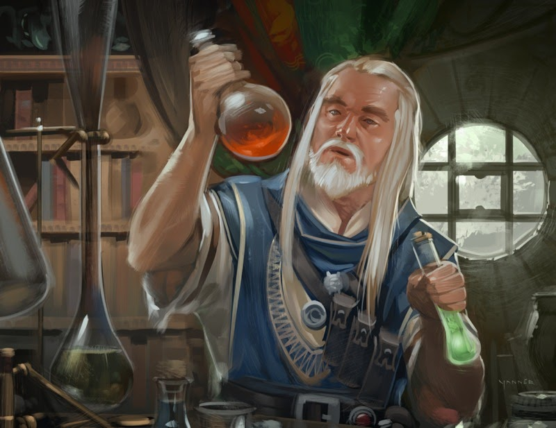
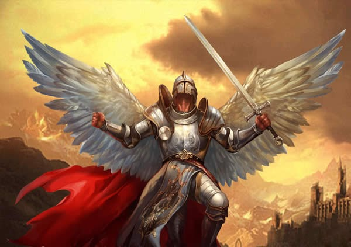
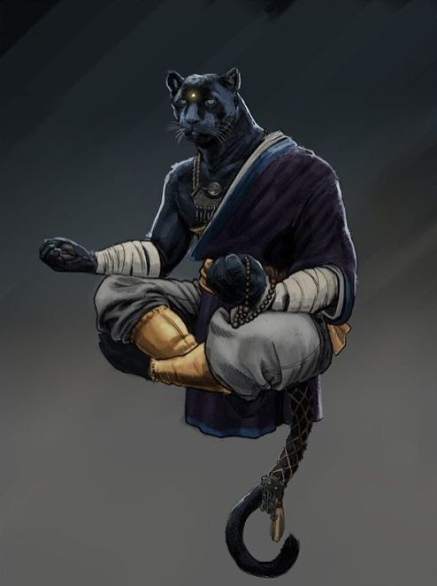
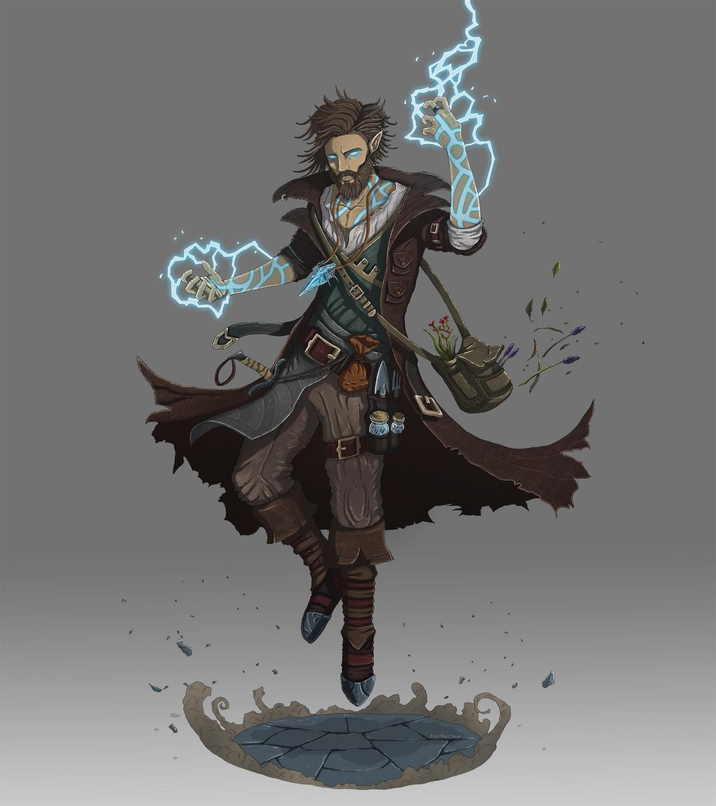
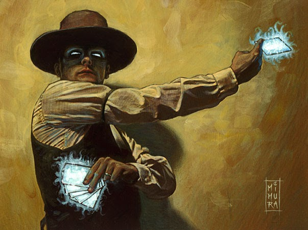
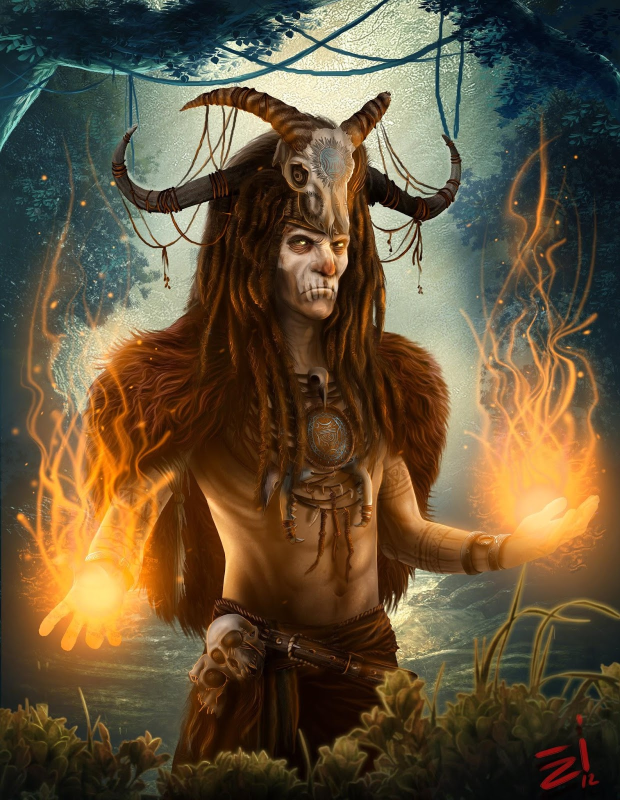
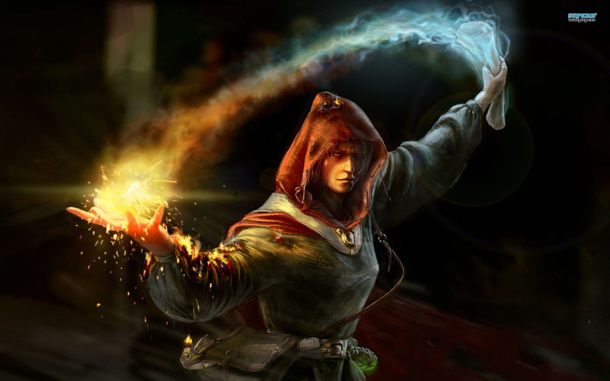
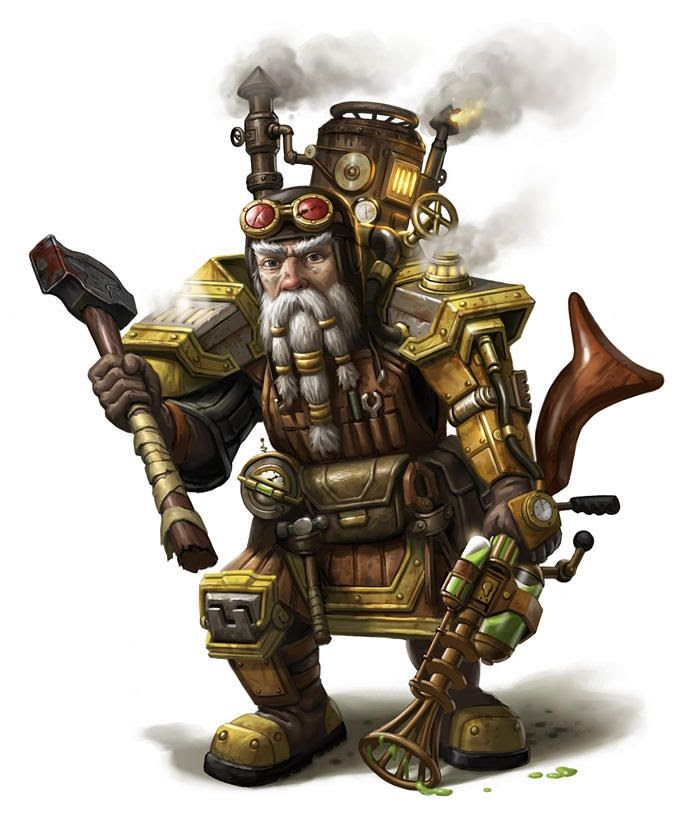

# Magics of Mardha

Sed lacinia laoreet arcu a congue. Pellentesque vel vehicula purus. Vestibulum ante ipsum primis in faucibus orci luctus et ultrices posuere cubilia curae; Sed ut tempor metus, eu sollicitudin tortor. Praesent quis porttitor turpis, sit amet consequat dolor. Fusce efficitur convallis pharetra.

## Sources of Magic

### Arcum

### Divinity

### Syn

### Wakana

## Magic Backgrounds

### Alchemy

##### ___Alchemy (Smarts) - 4 Starting Powers___

The Mecca of Mardha, a metropolis that floats above the ruins of Zaresyn and serves as home to the central Syn harvesting operation. Brings the various cultures of Mardha together for commerce and political engagements. Creates and distributes Mardha’s universal currency, Shards.

### Blessings

##### ___Faith (Spirit) - 3 Starting Powers___

Nunc rhoncus efficitur libero eu pellentesque. Quisque ut commodo dui, vel aliquam justo. Sed dignissim enim eu turpis interdum, a congue justo imperdiet. Ut rutrum, arcu id efficitur dapibus, tellus ligula scelerisque purus, et porta leo neque facilisis felis. Etiam eget dapibus elit, consectetur laoreet dolor.
 
 

### Chi Mastery

##### ___Separated Starting Powers (Spirit) - 2 Starting Powers___

Proin quis semper lectus. Donec ac leo egestas diam facilisis dictum vel ac libero. Praesent consectetur tincidunt felis, at rhoncus metus vulputate aliquam. Nulla facilisi. In lectus erat, ultricies tempus ultrices sed, egestas vitae leo. Mauris ornare justo vel urna dictum aliquam ut sed elit. Pellentesque habitant morbi tristique senectus et netus et malesuada fames ac turpis egestas.
 
 
 
 
 
 

### Gifts

##### ___Focus (No linked att.) - 1 Power___

Nunc luctus eu ex in accumsan. Duis efficitur velit vel lectus cursus, eu placerat dui volutpat. Curabitur ultrices tellus ut justo fermentum, eu aliquam dolor interdum. Aenean viverra, mi id mollis laoreet, mauris tortor rhoncus sapien, eget auctor ex felis sed libero.
 
 
 
 
 
 

### Hexslinging

##### ___Gambling (Smarts) - 2 Starting Powers___

Hexslingers, sometimes referred to as Hucksters, perform feats of divination to contact Manitous, mischievous spirits that roam the hunting grounds.  Through a battle of wits a Hexslinger attempts to manifest magical Starting Powers, or he can bait the Manitou into a gamble for instant casting and potential bonuses - However losing a hand of poker to a Manitou can prove extremely deadly.

### Rituals 

##### ___Spirituality (Spirit) - 3 Starting Powers___

Proin quis semper lectus. Donec ac leo egestas diam facilisis dictum vel ac libero. Praesent consectetur tincidunt felis, at rhoncus metus vulputate aliquam. Nulla facilisi. In lectus erat, ultricies tempus ultrices sed, egestas vitae leo. Mauris ornare justo vel urna dictum aliquam ut sed elit. Pellentesque habitant morbi tristique senectus et netus et malesuada fames ac turpis egestas.
 
 
 
 

### Scribing 

##### ___Spellcasting (Smarts) - 3 Starting Powers___

Nunc rhoncus efficitur libero eu pellentesque. Quisque ut commodo dui, vel aliquam justo. Sed dignissim enim eu turpis interdum, a congue justo imperdiet. Ut rutrum, arcu id efficitur dapibus, tellus ligula scelerisque purus, et porta leo neque facilisis felis. Etiam eget dapibus elit, consectetur laoreet dolor.

### Syngineering/Tinkering

##### ___Syngineering/Tinkering (Smarts) - 2 Starting Powers___

Fusce sed sagittis nisi, quis dapibus enim. Etiam rutrum iaculis orci nec tempus. Proin at pretium justo. Proin euismod facilisis suscipit. Nulla ac odio a odio faucibus faucibus vel at orci. Nulla congue semper odio, sed finibus ante mattis pretium. Vivamus suscipit blandit auctor. Proin vel ultricies nisl.
 
 
 
 
 