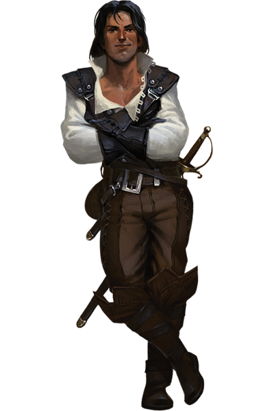
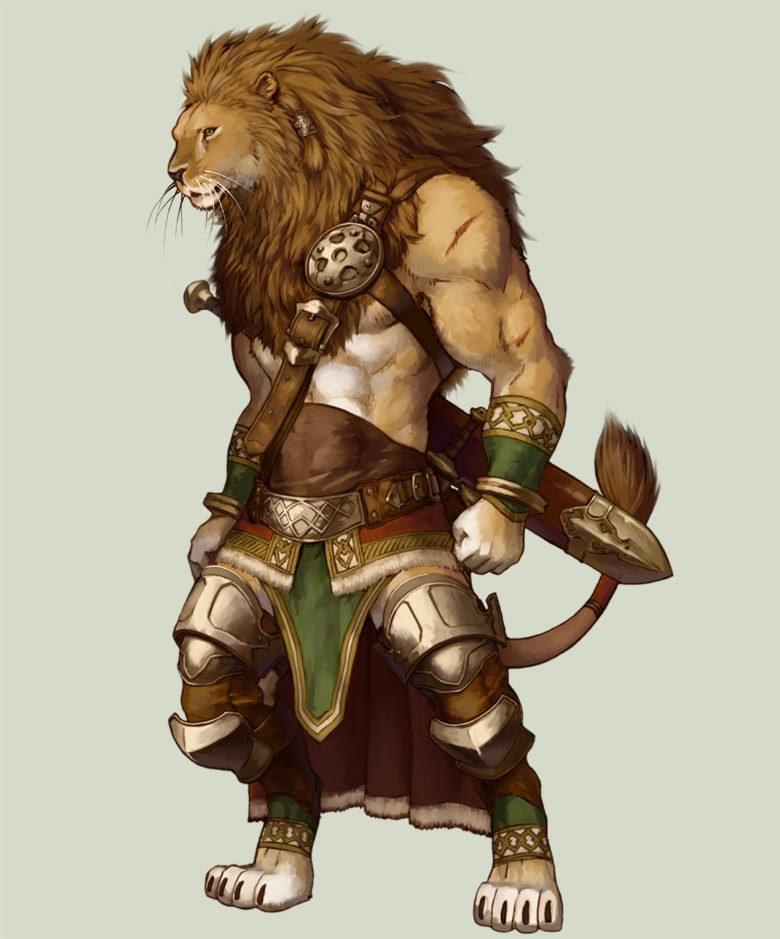
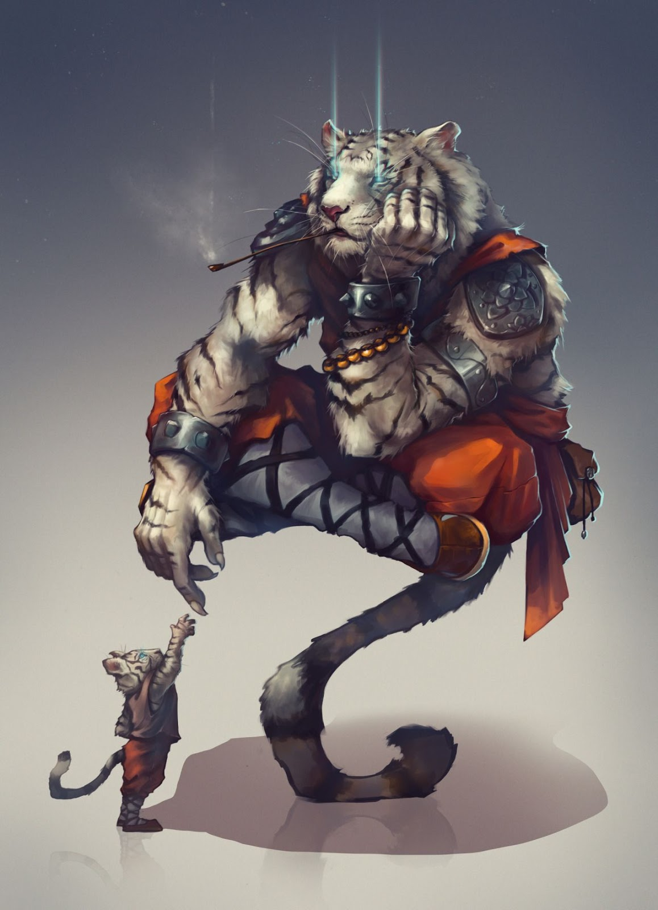
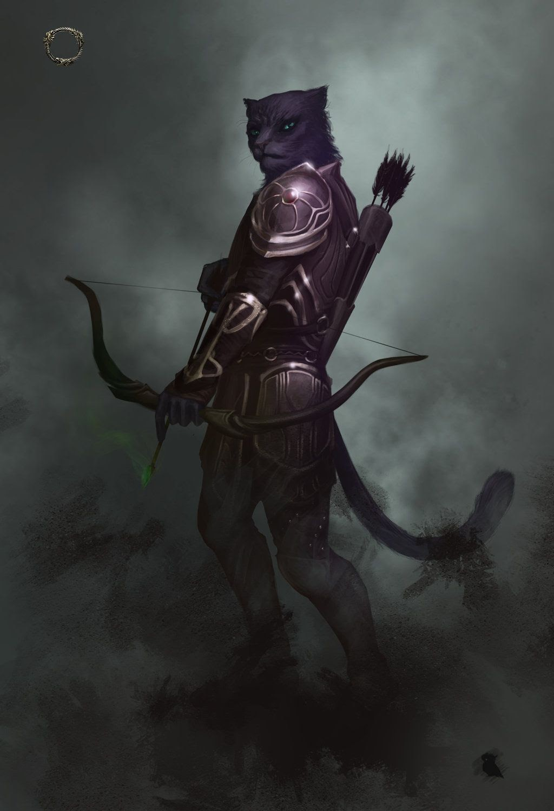
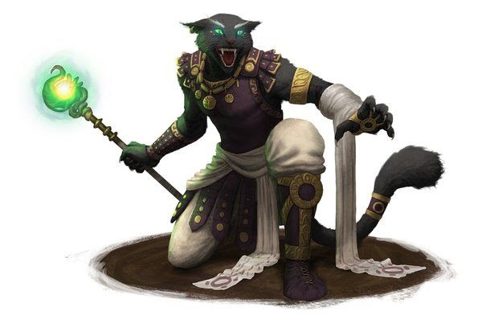
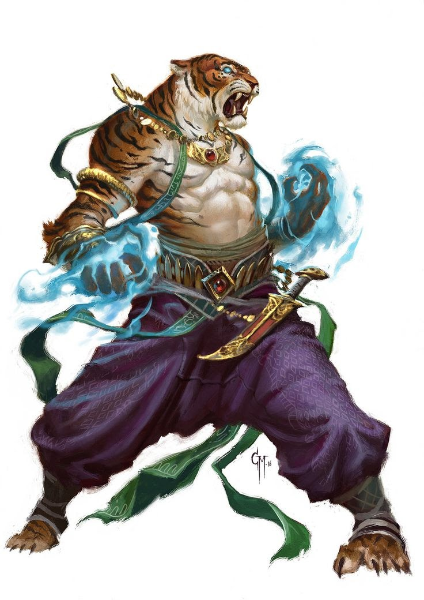
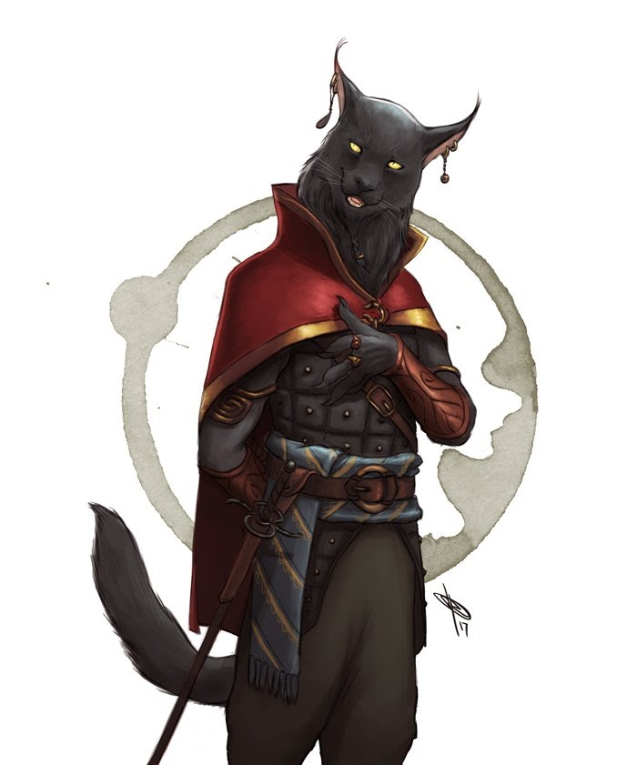
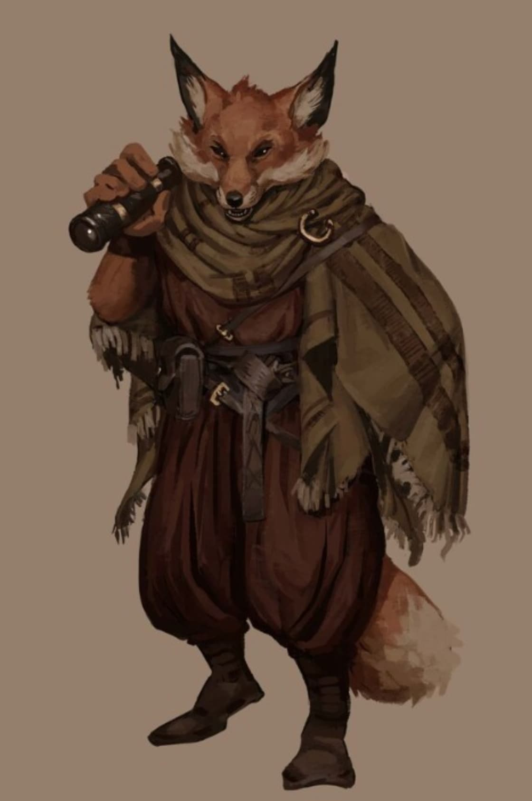
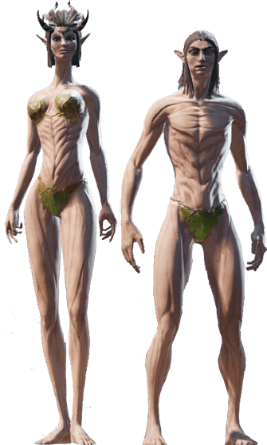

# The Races of Mardha

Lorem ipsum dolor sit amet, consectetur adipiscing elit. Proin massa metus, pulvinar sed ornare nec, lacinia a purus. Sed ullamcorper ullamcorper nisl, et lacinia quam porta vestibulum. In vitae neque augue. Suspendisse nisl enim, efficitur id posuere eget, ullamcorper non mauris. Suspendisse suscipit, odio a congue maximus, turpis sapien lacinia ligula, quis dignissim sapien justo ut leo. Nulla dapibus facilisis vulputate. Donec eget metus nec metus rutrum pharetra. Sed tristique sem leo, ac rutrum turpis maximus quis.

## Human

Human

Curabitur ornare velit non ornare sagittis. Vestibulum commodo laoreet diam, at cursus augue posuere dignissim. Donec quis arcu augue. Fusce at augue a nibh vehicula volutpat id eget enim. Maecenas malesuada facilisis nibh, nec venenatis lacus bibendum sit amet. Praesent scelerisque nibh ex, eget convallis eros ultrices vel.

<blockquote>

<strong>+ Adaptability: </strong>All humans begin play with any Novice Edge of their choosing. They must meet its Requirements as usual.

</blockquote>

 
 
 
 

## Felidar

Felidar

Donec magna nulla, feugiat vel sollicitudin ut, fringilla eget ligula. Mauris vel velit viverra, pulvinar nulla et, tempor elit. Mauris accumsan, est quis rhoncus vehicula, tortor ligula tristique nulla, sed suscipit metus arcu vel lacus. Etiam non enim elit. Interdum et malesuada fames ac ante ipsum primis in faucibus.

<blockquote>

<strong>+ Natural Weapons: </strong>All Felidar have natural weapons. They can attact with their claws, or with a bite, for str+d4 damage. They can never be an unarmed defender.

<strong>- Curiosity Killed The Cat: </strong>Instincive curiosity flows in all Felidar. They must take the Curious (Major) hindrance.

<strong>- Can’t Swim: </strong>Felidar hate water, and so most of them never learn to swim at all. -2 to all Atheltics(Swimming) rolls.

</blockquote>

### Leo Clan

Nulla interdum sollicitudin dui, eget laoreet massa ornare non. Suspendisse odio arcu, aliquam sit amet efficitur vel, semper vel tellus. Fusce elit ex, consectetur quis posuere quis, rutrum eget purus. Donec ac ante ac turpis luctus euismod. 

<blockquote>

<strong>+ Str starts at d6 and max increases to d12+1: </strong>All Felidar have natural weapons. They can attact with their claws, or with a bite, for str+d4 damage. They can never be an unarmed defender.

<strong>+ Starts with “Brute” edge: </strong>Instincive curiosity flows in all Felidar. They must take the Curious (Major) hindrance.

<strong>+ size - toughness +2: </strong>Felidar hate water, and so most of them never learn to swim at all. -2 to all Atheltics(Swimming) rolls.

<strong>- big: </strong>Felidar hate water, and so most of them never learn to swim at all. -2 to all Atheltics(Swimming) rolls.

<strong>- loyal hinderance: </strong>Felidar hate water, and so most of them never learn to swim at all. -2 to all Atheltics(Swimming) rolls.

<strong>- no common knowledge core skill: </strong>Felidar hate water, and so most of them never learn to swim at all. -2 to all Atheltics(Swimming) rolls.

</blockquote>

### Yuu-Shin Clan

Aliquam erat volutpat. Nam ac augue id arcu facilisis maximus sed eu nisl. Donec porta mattis lorem vitae aliquam. Morbi dui ligula, vulputate a porta vel, aliquam vel massa.

<blockquote>

<strong>+ spirit starts at d6 and max increases to d12+1: </strong>All Felidar have natural weapons. They can attact with their claws, or with a bite, for str+d4 damage. They can never be an unarmed defender.

<strong>+ parry: </strong>Instincive curiosity flows in all Felidar. They must take the Curious (Major) hindrance.

<strong>+ size - toughness +1: </strong>Felidar hate water, and so most of them never learn to swim at all. -2 to all Atheltics(Swimming) rolls.

<strong>+ alertness edge (+2 to notice checks): </strong>Felidar hate water, and so most of them never learn to swim at all. -2 to all Atheltics(Swimming) rolls.

<strong>- mild mannered (-2 intimidation, -2 taunt): </strong>Felidar hate water, and so most of them never learn to swim at all. -2 to all Atheltics(Swimming) rolls.

<strong>- no persuasion or common knowledge core skills: </strong>Felidar hate water, and so most of them never learn to swim at all. -2 to all Atheltics(Swimming) rolls.

</blockquote>

### Panthera Clan

Mauris nec purus gravida, tincidunt velit tempus, tincidunt nisi. Etiam rhoncus ex felis, sit amet malesuada tellus placerat in. Duis convallis tortor turpis, vitae hendrerit massa pulvinar a.

<blockquote>

<strong>+ agi starts at d6 and max increases to d12+1: </strong>All Felidar have natural weapons. They can attact with their claws, or with a bite, for str+d4 damage. They can never be an unarmed defender.

<strong>+ low light vision: </strong>Instincive curiosity flows in all Felidar. They must take the Curious (Major) hindrance.

<strong>+ pace (pace +2 and run die +1): </strong>Felidar hate water, and so most of them never learn to swim at all. -2 to all Atheltics(Swimming) rolls.

<strong>+ parry: </strong>Felidar hate water, and so most of them never learn to swim at all. -2 to all Atheltics(Swimming) rolls.

<strong>- racial enemy (TBD): </strong>Felidar hate water, and so most of them never learn to swim at all. -2 to all Atheltics(Swimming) rolls.

<strong>- no common knowledge core skill: </strong>Felidar hate water, and so most of them never learn to swim at all. -2 to all Atheltics(Swimming) rolls.

<strong>- bloodthirsty: </strong>Felidar hate water, and so most of them never learn to swim at all. -2 to all Atheltics(Swimming) rolls.

</blockquote>

### Tigris Clan

Praesent ac quam a orci imperdiet ultricies nec sed odio. Ut posuere tincidunt interdum. Nulla varius convallis orci, vitae faucibus arcu eleifend quis. Quisque sed malesuada enim, sit amet blandit massa. 

<blockquote>

<strong>+ smarts starts at d6 and max increases to d12+1: </strong>All Felidar have natural weapons. They can attact with their claws, or with a bite, for str+d4 damage. They can never be an unarmed defender.

<strong>+ starts with arcane resistance edge: </strong>Instincive curiosity flows in all Felidar. They must take the Curious (Major) hindrance.

<strong>+ size (toughness +1): </strong>Felidar hate water, and so most of them never learn to swim at all. -2 to all Atheltics(Swimming) rolls.

<strong>+ low light vision: </strong>Felidar hate water, and so most of them never learn to swim at all. -2 to all Atheltics(Swimming) rolls.

<strong>- overconfident major hinderance: </strong>Felidar hate water, and so most of them never learn to swim at all. -2 to all Atheltics(Swimming) rolls.

<strong>- racial enemy (TBD): </strong>Felidar hate water, and so most of them never learn to swim at all. -2 to all Atheltics(Swimming) rolls.

<strong>- parry: </strong>Felidar hate water, and so most of them never learn to swim at all. -2 to all Atheltics(Swimming) rolls.

</blockquote>

### Mongrel

Nullam sit amet ipsum nisl. Quisque fermentum ex lorem, at finibus velit accumsan posuere. Pellentesque habitant morbi tristique senectus et netus et malesuada fames ac turpis egestas. Curabitur vitae ex eu arcu condimentum vestibulum vel ut leo.

<blockquote>

<strong>+ adaptable (free edge - must meet reqs): </strong>All Felidar have natural weapons. They can attact with their claws, or with a bite, for str+d4 damage. They can never be an unarmed defender.

<strong>+ start with luck edge (+1 benny per session): </strong>Instincive curiosity flows in all Felidar. They must take the Curious (Major) hindrance.

<strong>+ parry: </strong>Felidar hate water, and so most of them never learn to swim at all. -2 to all Atheltics(Swimming) rolls.

<strong><strong>- frail (-1 toughness): </strong></strong></strong>Felidar hate water, and so most of them never learn to swim at all. -2 to all Atheltics(Swimming) rolls.

<strong>- no bite from base Felidar: </strong>Felidar hate water, and so most of them never learn to swim at all. -2 to all Atheltics(Swimming) rolls.

<strong>- minor greedy hinderance: </strong>Felidar hate water, and so most of them never learn to swim at all. -2 to all Atheltics(Swimming) rolls.

</blockquote>

## Vulpen

Vulpen

Donec enim nisi, mattis a venenatis a, mattis vel ipsum. Integer sagittis tempus faucibus. Nullam non tellus risus. Curabitur eu massa vitae ipsum maximus tristique eget at massa. Etiam nibh nulla, blandit a metus sit amet, semper placerat lacus. Morbi non sagittis elit.

<blockquote>

<strong>+ start with pace 8 and a d8 running die: </strong>All Felidar have natural weapons. They can attact with their claws, or with a bite, for str+d4 damage. They can never be an unarmed defender.

<strong>+ start with a d6 in Smarts (can be increased to d12+1): </strong>Instincive curiosity flows in all Felidar. They must take the Curious (Major) hindrance.

<strong>+ taunt starts at d6: </strong>Felidar hate water, and so most of them never learn to swim at all. -2 to all Atheltics(Swimming) rolls.

<strong>+ low light vision: </strong>Felidar hate water, and so most of them never learn to swim at all. -2 to all Atheltics(Swimming) rolls.

<strong><strong>- -1 to str rolls: </strong></strong></strong>Felidar hate water, and so most of them never learn to swim at all. -2 to all Atheltics(Swimming) rolls.

<strong>- size (-1 toughness): </strong>Felidar hate water, and so most of them never learn to swim at all. -2 to all Atheltics(Swimming) rolls.

<strong>- stubborn (Minor) hindrance: </strong>Felidar hate water, and so most of them never learn to swim at all. -2 to all Atheltics(Swimming) rolls.

<strong>- greedy (Minor) hindrance: </strong>Felidar hate water, and so most of them never learn to swim at all. -2 to all Atheltics(Swimming) rolls.

</blockquote>

## Elf

Elf

Donec blandit ornare felis, sed pellentesque risus aliquam sit amet. Aenean in malesuada mi. Maecenas nec elit luctus, pellentesque sem a, ornare orci. Praesent nec venenatis mi. Suspendisse eget rutrum mi. Praesent tempor malesuada velit, vitae rhoncus elit aliquam quis.

### Wild Elves

Eret eros nunc, venenatis id gravida eget, eleifend at turpis. Nunc mollis turpis vel massa viverra dignissim. Aliquam eu sem mi. Duis sed massa ut lorem convallis scelerisque sit amet sit amet quam.

<blockquote>

<strong>+ start with d6 spirit and max is increased to d12+1: </strong>All Felidar have natural weapons. They can attact with their claws, or with a bite, for str+d4 damage. They can never be an unarmed defender.

<strong>+ flesh reading (free power and unique casting): </strong>Instincive curiosity flows in all Felidar. They must take the Curious (Major) hindrance.

<strong>+ regeneration: </strong>Felidar hate water, and so most of them never learn to swim at all. -2 to all Atheltics(Swimming) rolls.

<strong>+ parry: </strong>Felidar hate water, and so most of them never learn to swim at all. -2 to all Atheltics(Swimming) rolls.

<strong><strong>- strength penalty (-1 to strength rolls): </strong></strong></strong>Felidar hate water, and so most of them never learn to swim at all. -2 to all Atheltics(Swimming) rolls.

<strong>- frail (-1  toughness): </strong>Felidar hate water, and so most of them never learn to swim at all. -2 to all Atheltics(Swimming) rolls.

<strong>- no common knowledge core skill: </strong>Felidar hate water, and so most of them never learn to swim at all. -2 to all Atheltics(Swimming) rolls.

<strong>- outsider (minor): </strong>Felidar hate water, and so most of them never learn to swim at all. -2 to all Atheltics(Swimming) rolls.

</blockquote>

### Valen Elves

### "High Elves" - rename incoming

## Motharian